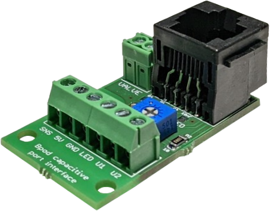

# Capacitive Port Interface for Bpod State Machine

A drop-in replacement for the [regular port interface](https://www.sanworks.io/shop/viewproduct?productID=1004) enabling for capacitive sensing of lick events. Connect a metal lickspout with a short piece of wire to the SNS port of the interface. Baseline calibration will be performed upon power-on - it can be triggered by briefly unplugging the port interface's RJ45 cable from the Bpod's behavior port once everything is in place.


## Bill of Materials
| Item     | Vendor    | Qty | Part Number                                                                                                                        | Description                 |
| :------- | :------   | :-: | :--------------------------------------------------------------------------------------------------------------------------------- | :-------------------------  |
| C1       | Digi-Key  |  1  | [CC1206JRX7R9BB682-ND](https://www.digikey.com/products/en?keywords=CC1206JRX7R9BB682-ND)                                                        | 6.8 nF capacitor (1206)      |
| C2, C3   | Digi-Key  |  2  | [311-1179-2-ND](https://www.digikey.com/products/en?keywords=311-1179-2-ND)                                                        | 100 nF capacitor (1206)     |
| IC1      | Digi-Key  |  1  | [AT42QT1011-TSHRTR-ND](https://www.digikey.com/products/en?keywords=AT42QT1011-TSHRTR-ND)                                          | touch sensor IC             |
| R1       | Digi-Key  |  1  | [13-RC1206FR-1010KLTR-ND](https://www.digikey.com/products/en?keywords=13-RC1206FR-1010KLTR-ND)                                    | 10k ohm resistor (1206)     |
| R2       | Digi-Key  |  1  | [13-RC1206FR-1010RLTR-ND](https://www.digikey.com/products/en?keywords=13-RC1206FR-1010RLTR-ND)                                    | 10 ohm resistor (1206)      |
|          | Digi-Key  |  1  | [3362P-501LF-ND](https://www.digikey.com/products/en?keywords=3362P-501LF-ND)                                                      | 500 ohm trimpot             |
|          | Digi-Key  |  1  | [277-1721-ND](https://www.digikey.com/products/en?keywords=277-1721-ND)                                                            | 2 pos screw terminal	    |
|          | Digi-Key  |  1  | [277-1736-ND](https://www.digikey.com/products/en?keywords=277-1736-ND)                                                            | 4 pos screw terminal	    |
|          | Digi-Key  |  1  | [A31413-ND](https://www.digikey.com/products/en?keywords=A31413-ND)                                                                | Ethernet jack               |
|          | Lee Valve |  1  | [LHDA1231115H](https://www.theleeco.com/products/electro-fluidic-systems/solenoid-valves/control-valves/lhd-series/3-port/ported/) | Solenoid valve              |

The above BOM is for the ```no_user``` version of the PCB. If you want to access the 
extra two lines of the RJ45 connector (like we do at Poulet-Lab) use the respective version of the PCB (```PortBreakoutCapacitive_r*.brd```) and swap the 4 position screw terminal for a 6 position screw terminal ([277-1738-ND](https://www.digikey.com/products/en?keywords=277-1738-ND)).
